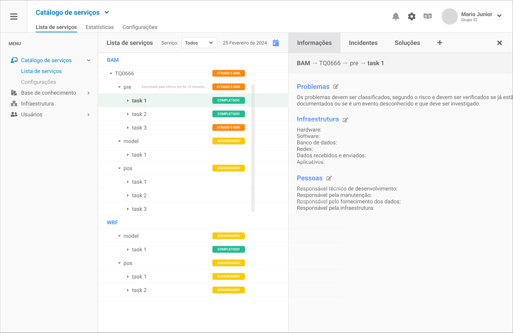
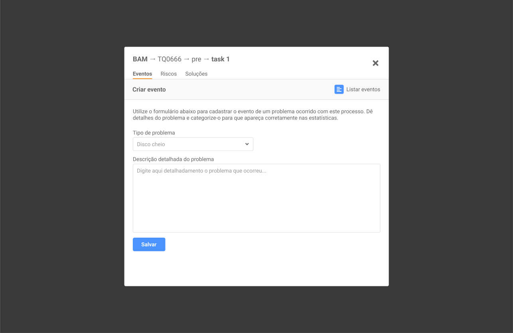
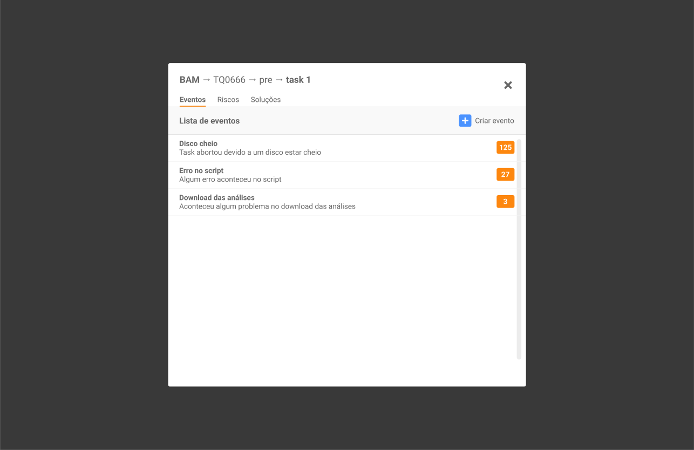
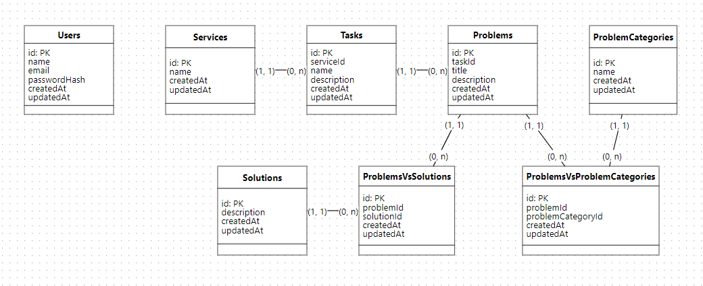

# Silo API (silo-api)

O **Silo** é um aplicativo para fornecer informações mais rápido e eficiente dos processos e atividades realizadas no supercomputador, monitoradas pelo **Grupo de Produtos e Processos (PP)** do **CPTEC/INPE**.

Neste projeto serão utilizados nomes de variáveis, funções, comentários e classes somente em inglês. A tabulação está sendo feita dois espaços. Obrigatório o uso do plugin _Prettier_ no Visual Studio Code.

A API será desenvolvida para dar suporte ao front-end do projeto.






## Instalação

**1 - Instalar todas as dependências de uma só vez:**

```bash
> npm install
```

**2 - Ou instalar as dependências isoladamente:**

```bash
> npm install express --save
> npm install cors --save
> npm install body-parser --save
> npm install dotenv --save
> npm install sequelize sqlite3 --save
> npm install bcrypt --save
> npm install jsonwebtoken --save
> npm install swagger-ui-express --save
```

E também as dependências de desenvolvimento:

```bash
> npm install sequelize-cli --save-dev
> npm install nodemon --save-dev
> npm install jest --save-dev
> npm install supertest --save-dev
> npm install swagger-autogen --save-dev
```

## Variáveis de ambiente

Foi criado manualmente o arquivo _.env_ no root do projeto, e configurado as variáveis de ambiente:

```bash
NODE_ENV=development
PORT=3030
```

Ao alterar o ambiente para produção deve usar _NODE_ENV=production_. Os valores possíveis são: development, test ou production, conforme o arquivo _./config/config.json_ criado pelo sequelize.

## Arquivos do projeto

O projeto está dividido em diretórios e arquivos com responsabilidades diferentes.

```bash
silo-api/
├─ .git
├─ assets/
│  └─ img/
├─ config/
│  └─ config.json
├─ controllers/
│  ├─ problemcategories.controller.js
│  ├─ problems.controller.js
│  ├─ problemsvsproblemcategories.controller.js
│  ├─ problemsvssolutions.controller.js
│  ├─ services.controller.js
│  ├─ solutions.controller.js
│  ├─ tasks.controller.js
│  └─ users.controller.js
├─ database/
│  ├─ mer.png
│  └─ silo.sqlite
├─ middlewares/
│  ├─ problemcategories.middleware.js
│  ├─ problems.middleware.js
│  ├─ services.middleware.js
│  ├─ solutions.middleware.js
│  ├─ tasks.middleware.js
│  ├─ users.middleware.js
├─ migrations/
├─ models/
│  ├─ index.js
│  ├─ problemcategories.js
│  ├─ problems.js
│  ├─ problemsvsproblemcategories.js
│  ├─ problemsvssolutions.js
│  ├─ services.js
│  ├─ solutions.js
│  ├─ tasks.js
│  ├─ users.js
├─ node_modules/
├─ routes/
│  ├─ auth.js
│  └─ index.js
├─ seeders/
├─ tests/
├─ .env
├─ .gitignore
├─ config.js
├─ index.js
├─ package.json
├─ README.md
├─ swagger-gen.js
├─ swagger-gen.json
└─ swagger.json
```

A estrutura abaixo pode ser obtida inserindo o comando _tree_ no terminal do Windows. É o arquivo _./index.js_ que contém os scripts para inicializar o servidor.

## Documentação

A documentação completa será feita com a especificação do padrão [OpenAPI 3.1.0](https://spec.openapis.org/oas/v3.1.0), usando o [Swagger](https://swagger.io/). Pode-se editar a documentação através do o [Swagger Editor online](https://editor.swagger.io/). A rota para a documentação está em _/api/docs/_. A documentação deve ser editada no arquivo _swagger.json_.

Para gerar a documentação básica automaticamente com o _Swagger_ irei utilizar o _Swagger Autogen_. Para isso é só executar o arquivo _swagger-gen.js_ que adicionei ao projeto. Esse arquivo pega as rotas e gera a documentação automaticamente para cada uma delas, mas sem detalhes e descrição:

```bash
> node swagger-gen
```

Depois é só pegar o que foi gerado, substituir e adaptar no arquivo _swagger.json_.

## Configuração do banco de dados

O Diagrama de Entidade Relacionamento (DER) a seguir descreve as entidades e relacionamentos do projeto.



_Observação:_ O diagrama acima foi construído rapidamente usando o [brModelo](https://www.brmodeloweb.com/), ferramenta para modelagem de dados online e gratuita.

### Sequelize CLI:

**1 - Inicializar o sequelize, criando o arquivo _./config/config.json_ na raíz do projeto:**

```bash
> npx sequelize-cli init
```

Em _./config/config.json_ alterar o development para:

```bash
"development": {
  "database": "silo_development",
  "storage": "./database/silo.sqlite",
  "dialect": "sqlite"
},
```

**2 - Criar o banco de dados:**

```bash
> npx sequelize-cli db:create
```

_Observação:_ Se o banco de dados for do tipo SQLite é preciso criar o arquivo _./database/silo.sqlite_ manualmente através do comando _touch silo.sqlite_ ou em novo arquivo no VSCode.

**3 - Criar as entidades do banco de dados:**

```bash
> npx sequelize-cli model:generate --name Users --attributes name:string,email:string,password:string
> npx sequelize-cli model:generate --name Services --attributes name:string
> npx sequelize-cli model:generate --name Tasks --attributes serviceId:integer,name:string,description:string
> npx sequelize-cli model:generate --name Problems --attributes taskId:integer,title:string,description:string
> npx sequelize-cli model:generate --name ProblemCategories --attributes name:string
> npx sequelize-cli model:generate --name Solutions --attributes description:string
> npx sequelize-cli model:generate --name ProblemsVsSolutions --attributes problemId:integer,solutionId:integer
> npx sequelize-cli model:generate --name ProblemsVsProblemCategories --attributes problemId:integer,problemCategoryId:integer
```

_Observação:_ Insira vírgulas sem espaços.

**4 - Executar as migrations para aplicar as alterações, toda vez que um model do Sequelize acima:**

```bash
> npx sequelize-cli db:migrate
```

**5 - Alterações e modificações em tabelas**

Se no futuro quiser **alterar a coluna de uma tabela**, criar uma nova migration com o comando, por exemplo:

```bash
> npx sequelize-cli migration:create --name alter-users
```

Depois editar o arquivo criado com o migration é possível alterar a estrutura. Por exemplo, para fazer com que o arquivo _20240506121018-alter-users.js_ (criado pelo comando acima) altere a coluna _password_ para _password_hash_ na tabela _Users_, é só editar o arquivo para deixá-lo da seguinte forma:

```bash
'use strict';

/** @type {import('sequelize-cli').Migration} */
module.exports = {
  async up (queryInterface, Sequelize) {
     await queryInterface.renameColumn("Users", "password", "password_hash");
  },

  async down (queryInterface, Sequelize) {
     await queryInterface.renameColumn("Users", "password_hash", "password");
  }
};
```

Depois rodar o comando abaixo para atualizar:

```bash
> npx sequelize-cli db:migrate
```

Entretanto, irei deixar do jeito que está.

**6 - Para criar relacionamentos entre tabelas, editar por exemplo o arquivo criado com o comando _npx sequelize-cli model:generate ..._ e adicionar references. Por exemplo:**

```bash
      serviceId: {
        type: Sequelize.INTEGER,
        references: {
          model: "Services",
          key: "id",
        },
        onUpdate: "CASCADE",
        onDelete: "CASCADE",
      },
```

Ficando assim, por exemplo no arquivo _20240506123928-create-tasks.js_:

```bash
'use strict';
/** @type {import('sequelize-cli').Migration} */
module.exports = {
  async up(queryInterface, Sequelize) {
    await queryInterface.createTable("Tasks", {
      id: {
        allowNull: false,
        autoIncrement: true,
        primaryKey: true,
        type: Sequelize.INTEGER
      },
      serviceId: {
        type: Sequelize.INTEGER,
        references: {
          model: "Services",
          key: "id",
        },
        onUpdate: "CASCADE",
        onDelete: "CASCADE",
      },
      createdAt: {
        allowNull: false,
        type: Sequelize.DATE
      },
      updatedAt: {
        allowNull: false,
        type: Sequelize.DATE
      }
    });
  },
  async down(queryInterface, Sequelize) {
    await queryInterface.dropTable("Tasks");
  }
};
```

Por fim rodar o comando abaixo para atualizar:

```bash
> npx sequelize-cli db:migrate
```

É necessário alterar também o arquivo do diretório _./models_, pois precisa estar definido com o relacionamento. Por exemplo, para o arquivo _./models/tasks.js_ alterar assim:

```bash
    static associate(models) {
      this.hasOne(models.Services, { foreignKey: "serviceId" });
    }
```

Para o arquivo _./models/problemsvssolutions.js_, deixar assim:

```bash
    static associate(models) {
      this.hasMany(models.Problems, { foreignKey: "problemId" });
      this.hasMany(models.Solutions, { foreignKey: "solutionId" });
    }
```

Fazer isso para cada tabela que tiver um relacionamento.

Para **criar uma nova coluna em uma tabela** após a tabela já ter sido criada, rodar por exemplo, o seguinte comando para criar uma nova _migration_:

```bash
> npx sequelize-cli migration:create --name alter-tasks
```

O arquivo de migração ficaria assim:

```bash
'use strict';
/** @type {import('sequelize-cli').Migration} */
module.exports = {
  async up(queryInterface, Sequelize) {
    await queryInterface.addColumn("Tasks", "name", {
      type: Sequelize.STRING
    });
  },
  async down(queryInterface, Sequelize) {
    await queryInterface.removeColumn("Tasks", "name");
  }
};
```

E então, execute para aplicar as alterações no banco de dados:

```bash
> npx sequelize-cli db:migrate
```

Acesse o link da documentação oficial da [Query Interface](https://sequelize.org/docs/v7/other-topics/query-interface/) do Sequelize para mais informações.

## Rotas

As rotas estão divididas da seguinte forma:

**Usuários: /api/users**

```bash
[GET]     /api/users      (Listar os usuários)
[GET]     /api/users?page=1&limit_per_page=10&order_by=id&order_sort=ASC&filter=mario
[POST]    /api/users      (Cadastrar um novo usuário)
[GET]     /api/users/:id  (Obter dados de um usuário pelo ID)
[PUT]     /api/users/:id  (Alterar dados de um usuário pelo ID)
[DELETE]  /api/users/:id  (Apagar um usuário pelo ID)
```

Para cadastrar um novo usuário é necessário enviar por _body_:

```bash
{
  "name": "Mario",
  "email": "mario@test.com",
  "password": "123456",
  "roles": ["admin", "editor", "viewer"]
}
```

É feito uma validação com o construtor de schemas [Yup](https://github.com/jquense/yup) para cada coluna utilizando middlewares:

```bash
const schema = {
  name: yup.string().trim().required(),
  email: yup.string().trim().email().required(),
  password: yup.string().min(6).max(30).required(),
  roles: yup.array().min(1).required(),
};
```

Isso também vale para as demais rotas.

**Serviços: /api/services**

```bash
[GET]     /api/services      (Listar os serviços)
[GET]     /api/services?page=1&limit_per_page=30&order_by=id&order_sort=ASC&filter=brams
[POST]    /api/services      (Cadastrar um novo serviço)
[GET]     /api/services/:id  (Obter dados de um serviço pelo ID)
[PUT]     /api/services/:id  (Alterar dados de um serviço pelo ID)
[DELETE]  /api/services/:id  (Apagar um serviço pelo ID)
```

```bash
{
  "name": "BAM"
}
```

```bash
const schema = {
  name: yup.string().trim().required(),
};
```

**Tarefas: /api/tasks**

```bash
[GET]     /api/tasks      (Listar as tarefas)
[GET]     /api/tasks?page=1&limit_per_page=30&order_by=id&order_sort=ASC&serviceId=1&filter=pos
[POST]    /api/tasks      (Cadastrar uma nova tarefa)
[GET]     /api/tasks/:id  (Obter dados de uma tarefa pelo ID)
[PUT]     /api/tasks/:id  (Alterar dados de uma tarefa pelo ID)
[DELETE]  /api/tasks/:id  (Apagar uma tarefa pelo ID)
```

**Informações: /api/problems**

```bash
[GET]     /api/problems      (Listar os problemas)
[GET]     /api/problems?page=1&limit_per_page=30&order_by=id&order_sort=ASC&taskId=1&filter=
[POST]    /api/problems      (Cadastrar um novo problema)
[GET]     /api/problems/:id  (Obter dados de um problema pelo ID)
[PUT]     /api/problems/:id  (Alterar dados de um problema pelo ID)
[DELETE]  /api/problems/:id  (Apagar um problema pelo ID)
```

**Categorias de problemas: /api/problemcategories**

```bash
[GET]     /api/problemcategories      (Listar as categorias de problemas)
[GET]     /api/problemcategories?page=1&limit_per_page=30&order_by=id&order_sort=ASC&filter=
[POST]    /api/problemcategories      (Cadastrar um novo problema)
[GET]     /api/problemcategories/:id  (Obter dados de um problema pelo ID)
[PUT]     /api/problemcategories/:id  (Alterar dados de um problema pelo ID)
[DELETE]  /api/problemcategories/:id  (Apagar um problema pelo ID)
```

**Soluções: /api/solutions**

```bash
[GET]     /api/solutions      (Listar as soluções)
[GET]     /api/solutions?page=1&limit_per_page=30&order_by=id&order_sort=ASC&filter=
[POST]    /api/solutions      (Cadastrar uma nova solução)
[GET]     /api/solutions/:id  (Obter dados de uma solução pelo ID)
[PUT]     /api/solutions/:id  (Alterar dados de uma solução pelo ID)
[DELETE]  /api/solutions/:id  (Apagar uma solução pelo ID)
```

**Problemas x soluções (relacionamento): /api/problemsvssolutions**

```bash
[POST]    /api/problemsvssolutions      (Cadastrar um relacionamento de problemas x solução)
[GET]     /api/problemsvssolutions?problemId=1  (Obter dados de um relacionamento de problemas x solução pelo ID do problema)
[GET]     /api/problemsvssolutions?solutionId=1  (Obter dados de um relacionamento de problemas x solução pelo ID da solução)
[DELETE]  /api/problemsvssolutions?problemId=1&solutionId=1  (Apagar um relacionamento de problemas x solução pelo ID do problema e da solução)
```

**Problemas x Categorias de problemas (relacionamento): /api/problemsvsproblemcategories**

```bash
[POST]    /api/problemsvsproblemcategories      (Cadastrar um relacionamento de problemas x categoria de problemas)
[GET]     /api/problemsvsproblemcategories?problemId=1  (Obter dados de um relacionamento de problemas x categoria de problemas pelo ID do problema)
[GET]     /api/problemsvsproblemcategories?problemCategoryId=1  (Obter dados de um relacionamento de problemas x categoria de problemas pelo ID da solução)
[DELETE]  /api/problemsvsproblemcategories?problemId=1&problemCategoryId=1  (Apagar um relacionamento de problemas x categoria de problemas pelo ID do problema e da solução)
```

**Documentação (usando Swagger): /api/docs**

```bash
[GET]    /api/docs      (Documentação de toda a API)
```

### Autorização com JWT

O projeto utiliza o [JWT](https://jwt.io/), pois tem a vantagem de transmitir os dados do usuário por meio de token. É melhor do que a utilização por Session, pois não precisa armazenar sessions no servidor, apenas utiliza o token do lado do cliente em uma localStorage, por exemplo. Utilizando esta abordagem, seguimos os padrões do RESTful.

```bash
[POST]    /api/auth      (Login com e-mail e senha para obter o token que será enviado em cada requisição)
```

Se o usuário possuir autorização (_roles_), ele poderá acessar a rota. As _roles_ permitidas são: _admin_, _editor_ e _viewer_.

Para acessar deve inserir no _Bearer_ da requisição no _Insomnia_ ou _Postman_ e o _Bearer valor-do-token_ obtido através do login.

## Criando seeders

Algumas tabelas podem ser já pré-preenchidas, tanto para teste quanto para situações reais.

A tabela Users já terá algumas informações pré-preenchidas. Para isso vamos popular com alguns dados a tabela:

```bash
> npx sequelize-cli seed:generate --name Users
```

Realizar as seguintes alterações no arquivo criado, por exemplo, o arquivo _./seeders/20240510121749-Users.js_:

```bash
'use strict';

/** @type {import('sequelize-cli').Migration} */
module.exports = {
  async up (queryInterface, Sequelize) {
    await queryInterface.bulkInsert("Users", [
      { name: "Mario", email: "mario@teste.com", password: "viewe$2a$08$5YiRHW/o6.aW.ErN0lBx.uIA1zIl1cQ.S0xOKdlRlsipiMOzAAJFKr", roles: '["admin", "editor", "viewer"]', createdAt: "2024-05-07 13:42:14.060 +00:00", updatedAt: "2024-05-07 13:42:14.060 +00:00" },
      { name: "Lucas", email: "lucas@teste.com", password: "viewe$2a$08$5YiRHW/o6.aW.ErN0lBx.uIA1zIl1cQ.S0xOKdlRlsipiMOzAAJFKr", roles: '["editor", "viewer"]', createdAt: "2024-05-07 13:42:14.060 +00:00", updatedAt: "2024-05-07 13:42:14.060 +00:00" },
    ], {});
  },

  async down (queryInterface, Sequelize) {
    await queryInterface.bulkDelete("Users", null, {});
  }
};
```

E em seguida aplicar as alterações ao seeder específico:

```bash
> npx sequelize-cli db:seed --seed 20240510121749-Users.js
```

Para aplicar as alterações a todos os seeders, seria este o comando:

```bash
> npx sequelize-cli db:seed:all
```

Para desfazer um seed específico:

```bash
> npx sequelize db:seed:undo --seed 20240510121749-Users.js
```

Para desfazer todos os seeders gerados até o momento:

```bash
> npx sequelize db:seed:undo:all
```

Todas as rotas devem ser adicionadas no arquivo _./routes/index.js_. A rota de login está no arquivo _./routes/auth.js_.

## Rotinas de teste

Para os testes de servidor, usando _supertest_ é preciso alterar a variável de ambiente de execução para _test_ e usar o banco de dados de teste:

```bash
> npx sequelize-cli db:create --env test
> npx sequelize-cli db:migrate --env test
> npx sequelize-cli db:seed:all --env test
```

O servidor deve ser exportado, adicionar o seguinte no final do arquivo _./index.js_:

```bash
module.exports = app;
```

Para executar todas as rotinas de teste usando _jest_ e _supertest_:

```bash
> npm test
```

Essa rotina irá executar todos os arquivos com a extensão "_.test.js_" do diretório _./tests_.

Estou utilizando o [Insomnia](https://insomnia.rest/download) para testar as rotas, mas utilize o [Postman](https://www.postman.com/downloads/) ou a extensão [Boomerang](https://chromewebstore.google.com/detail/boomerang-soap-rest-clien/eipdnjedkpcnlmmdfdkgfpljanehloah?hl=pt-BR) no Google Chrome se você quiser.
